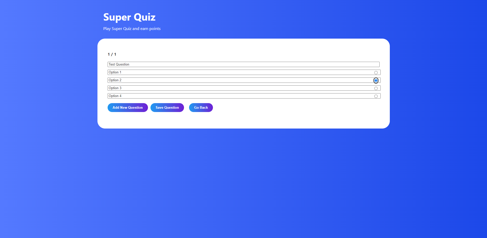
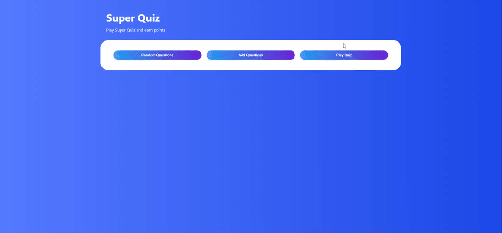
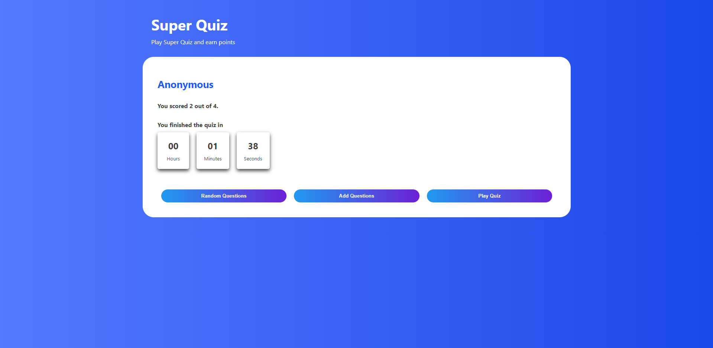

# Super Quiz

Super Quiz is a simple quiz app created using React and Styled Components. It has the following functionalities:

- Play Quiz
- Generate Random Questions
- Add Custom Questions
- Display Scorecard

## How To Run The Project

To run the project, execute the `npm start` command. It will run the app in the development mode.\
Open [http://localhost:3000](http://localhost:3000) to view it in the browser.

## Screenshots

### Home Screen

### Generate Random Questions

### Add Custom Questions

### Play Quiz

### Display Scorecard

